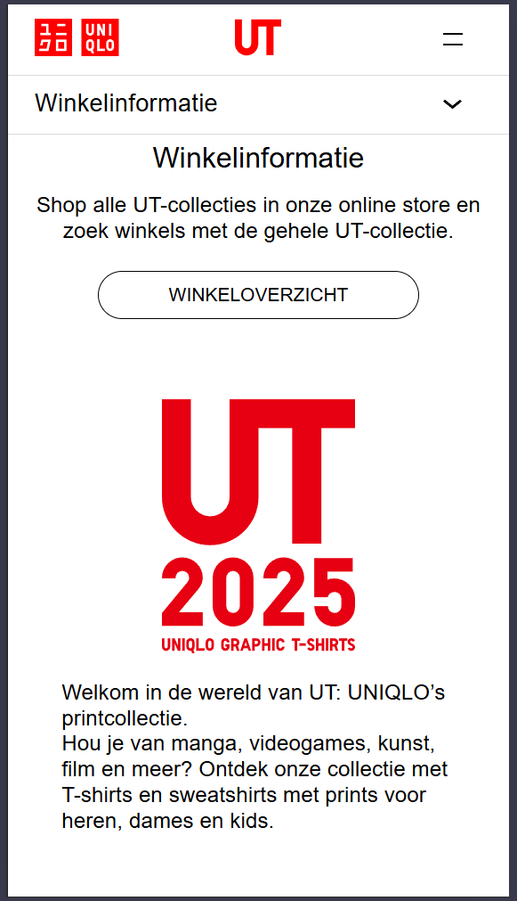
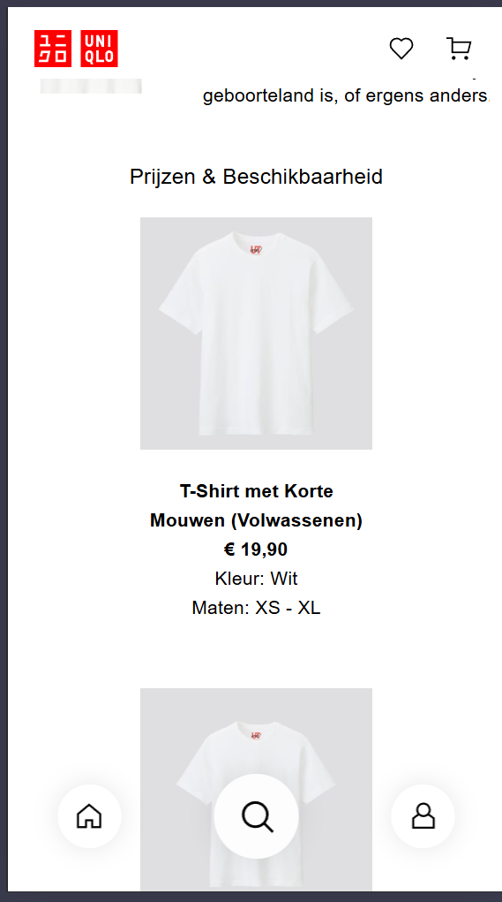
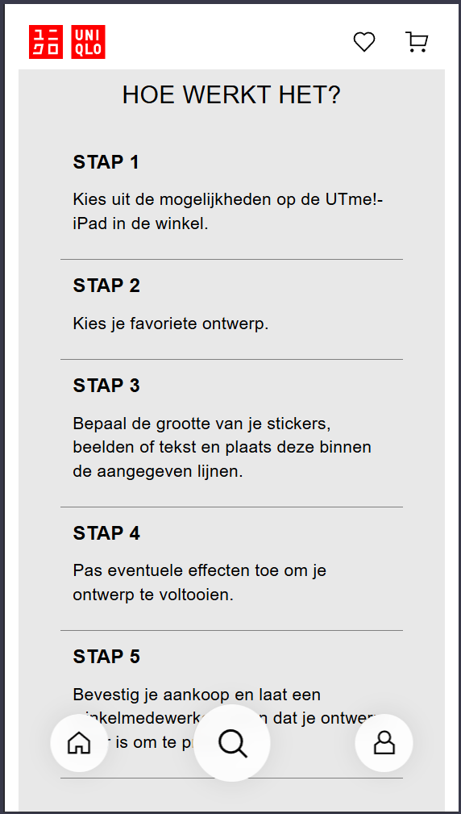

# Procesverslag
Markdown is een simpele manier om HTML te schrijven.  
Markdown cheat cheet: [Hulp bij het schrijven van Markdown](https://github.com/adam-p/markdown-here/wiki/Markdown-Cheatsheet).

Nb. De standaardstructuur en de spartaanse opmaak van de README.md zijn helemaal prima. Het gaat om de inhoud van je procesverslag. Besteedt de tijd voor pracht en praal aan je website.

Nb. Door *open* toe te voegen aan een *details* element kun je deze standaard open zetten. Fijn om dat steeds voor de relevante stuk(ken) te doen.

## Jij

  
uitwerken voor kick-off werkgroep

  ### Auteur:
  Donna Schilder

  #### Je startniveau:
  Blauw

  #### Je focus:
  Surface plane
 

## Je website

  
Uitwerken voor kick-off werkgroep

  ### Je opdracht:
  link naar de website die je gaat namaken óf de naam/omschrijving van je eigen ontwerp

  #### Screenshot(s) van de eerste pagina (small screen): 
  UT PRINT COLLECTIES
  
  
  
  
  
  
  https://www.uniqlo.com/nl/nl/special-feature/ut/lineup

  #### Screenshot(s) van de tweede pagina (small screen):
  Special Feature- UTme! 
  
   
   
   
   
   
  
  https://www.uniqlo.com/nl/nl/special-feature/utme

## Toegankelijkheidstest 1/2 (week 1)

  
uitwerken na test in 2e werkgroep

  ### Bevindingen
  Lijst met je bevindingen die in de test naar voren kwamen:
  
  ### Global Code
  De website van UNIQLO ziet er best netjes uit, maar mist hier en daar nog een 'lang' attribute en een unieke titel voor elke pagina. Ook zijn er een paar errors te vinden tijdens de HTML-checker die best gemakkelijk te voorkomen zijn door een andere element/attribute te gebruiken.
  
  

  ### Mobile & Touch
  De website kan bijna volledig geroteerd worden, maar niet ondersteboven.

  ### Headings
  Gebruikt soms meer dan 1 h1 per pagina, dit is iets waar ik dus op moet letten en zeker anders moet doen.

  ### Images
  Er missen soms alt tekst, en soms is het niet duidelijk genoeg wat er te zien is op de foto, ook mist er soms een beschrijving voor afbeeldingne met tekst; wat de tekst op de afbeelding is, wordt niet duidelijk gemaakt.
  
  ### Media
  Er wordt gebruik gemaakt van autoplay op de homepagina, maar dit ga ik niet na maken dus hier hoef ik mij niet druk op te maken.

## Breakdownschets (week 1)

  
uitwerken na afloop 3e werkgroep

  ### de hele pagina: 
  ### UT PRINT COLLECTIES
  
  

  ### Dynamisch deel (bijv menu): 
  ### Hamburger-menu
  
  

  
  ### Special Feature- UTme! 
  
  

  
  ### Dynamisch deel, hover: 
  
  

## Voortgang 1 (week 2)

  
uitwerken voor 1e voortgang

  ### Stand van zaken
  hier dit ging goed & dit was lastig (neem ook screenshots op van delen van je website en code)

  ### Agenda voor meeting
  samen met je groepje opstellen

  | student 1: Insa             | student 2: Mary-Jayne| student 3 Nauofal | student 4 Donna |
  | ---                         | ---                  | ---               | ---                                         |
  | H1, mag dat een afbeelding zijn? | nvt                  |          | Hoe ver is eigen creatieve inbreng mogelijk |
  | ...                         |                      |   |                                             | 
  | ...                         | ...                  | ...               | ...                                         |

  ### Verslag van meeting

Dit gesprek werd vooral gebruikt om te checken of alles goed ging en of er nog vragen waren. Voor mij was het belangrijk om vast te stellen in hoeverre de website die ik ga maken op de originele website van Uniqlo moet lijken. Ik was namelijk van plan om nog iets met illustraties te doen, omdat de huisstijl van Uniqlo vrij simpel is. Dat is prima, maar ik vond het toch een beetje saai. Ik kreeg dan ook te horen dat ik zeker mijn creativiteit mag inzetten voor extra decoratieve elementen, maar dat het wel belangrijk is om eerst te focussen op de basis van mijn code. Daar was ik het volledig mee eens.

## Voortgang 2 (week 3)

  
uitwerken voor 2e voortgang

  ### Stand van zaken
  hier dit ging goed & dit was lastig (neem ook screenshots op van delen van je website en code)

  ### Agenda voor meeting
  samen met je groepje opstellen

  | student 1: Insa             | student 2: Mary-Jayne| student 3 Nauofal      | student 4 Donna      |
  | ---                         | ---                  | ---                    | ---                  |
  | Hoe maak ik de plusjes op de afbeeldingen na een klik details geven over het product | nvt               | Niet aanwezing         | Ik wil dat de li-tjes die niet naar een andere pagina gaan (omdat ik die niet maak) er toch uitzien als linkjes; hoe doe ik dat?        |
  | ...                         |          |                        |                      | 
  | ...                         | ...                  |                        | ...                  |

  ### Verslag van meeting

Ik heb tijdens dit moment mijn code laten zien aan de student assistenten en daar kreeg ik al bijna meteen te horen dat mijn website er netjes en verzorgd uitziet. Hier ben ik natuurlijk erg blij mee. 

Er waren nog wel wat verbeterpuntjes, ik moet er voor zorgen dat ik mijn alt tekst inkort tot alleen de fuctionele waarde van de afbeelding/icoon inplaats van welke kleur het is. Maar in de lessen werd er verteld dat het beide erg nuttig zijn, dus zorg ik ervoor dat ik beide verwerk.

Ik moest er ook op letten dat ik mijn code goed in liet springen, wat ik helemaal vergeten was, maar daar hebben we 'Prettier' voor!

Ook kreeg ik een goede tip, als ik een link, die eigenlijk naar een andere pagina zou gaan, niet "werkend" kan maken maar er wel wil laten uitzien als een link, kan ik dat doen door ee slash (/) te gebruiken, dan gaat de link door naar de pagina waar die al op zit.

Ik moet ook niet vergen een id te zetten bij mijn form input anders is dat een error!

## Toegankelijkheidstest 2/2 (week 4)

  
uitwerken na test in 9e werkgroep

  ### Bevindingen
  Lijst met je bevindingen die in de test naar voren kwamen (geef ook aan wat er verbeterd is):

  ### Content
  Ik heb voor het gebruik van 'plain language' rekening gehouden met de taal die ik heb gebruikt voor bijvoobeeld de knoppen, ook heb ik alle links, buttons en labels goed aangegeven zodat dit duidelijk is voor een screenreader en gebruikers.
    
  ### Global Code
  Er zijn nog errors te vinden binnen mijn code, volgens de validator was het belangrijk om een legend **geen** child te maken van een forum, diet mag niet, ook is het     belangrijk dat ik spaties tussen mijn attributes haal. Dit heb ik meteen toegepast en nu zijn er geen errors meer, alleen info berichten; yay me!
  
  

   ### Keyboard
   Er missen in mijn code seen paar focus stylen, ik heb een groot deel van de linkjes en buttons al goed gestijled maar ik moet niet vergeten om dit bij **alles** te doen!
  
  ### Mobile & Touch
  De website kan bijna volledig geroteerd worden, maar niet ondersteboven.

  ### Headings
  Ik heb per pagina maar 1 h1 die bovenaan de pagina staat.

  ### Images
  Alle afbeeldingen hebben ene duidelijke alt tekst die omschrijft wat er te zien is maar ook of het een interactieve waarde heeft.

  
 

  ### Media
  Ik heb 1 SFX die alleen afgespeeld wordt als er op een afbeelding wordt geklikt, de klik is dan de start knop.

  ### Controls
  Ik maak altijd gebruik van buttosn voor buttosn en linkjes voor linkjes en het is altijd duidelijk of ze interactief zijn.

  ### Color contrast
  Er is een goed kleurcontrast voor afbeeldingen en knoppen, maar bij het hamburgermenu is dit nog mager, ook dit heb ik meteen aangepast door een andere kleru te gebruiken   zodat dit beter te zien is maar wel passend is voor de huisstijl 
  

## Voortgang 3 (week 4)

  
uitwerken voor 3e voortgang

  ### Stand van zaken
  hier dit ging goed & dit was lastig (neem ook screenshots op van delen van je website en code)

  ### Agenda voor meeting
  samen met je groepje opstellen

  | student 1: Insa      | student 2: Mary-Jayne          | student 3 Nauofal    | student 4 Donna        |
  | ---            | ---                | ---          | ---              |
  | x  | Iets met het hamburger menu            | heb ik te veel divs en kan het toch anders?    | mijn java stopt ermee; help!   |
  |  |  |  |  |
  | ...            | ...                | ...          | Mijn focus-mode wordt afgesneden bij mijn eerste pagina, hoe fix ik dit?            |

  ### Verslag van meeting
 - Ik heb vragen gesteld over en knop die slecht reageerde op mijn andere knop, waardoor het niet afgespeeld werd. Dit heb ik aangepast door in mijn java neer te zetten dat als(if) de knop bestaat, dat dan pas de fucntion wordt uitgevoerd. Dit was de oplossing voor mijn probleem.
 - Ik merkte tijdens het testen van de focus-mode, mijn linkejs werden afgesneden, dit is natuurlijk niet de bedoeling. Dit he ik kunnen aanpassen door een kleine paddign toe tevoegen waardoor de focus nu niet afgesneden wordt door de <li>!
  

## Eindgesprek (week 5)

  
uitwerken voor eindgesprek

  ### Je uitkomst - karakteristiek screenshots:
  

  ### Dit ging goed/Heb ik geleerd: 
  Korte omschrijving met plaatjes

  

  ### Dit was lastig/Is niet gelukt:
  Korte omschrijving met plaatjes

  

## Bronnenlijst

  
continu bijhouden terwijl je werkt

  Nb. Wees specifiek ('css-tricks' als bron is bijv. niet specifiek genoeg). 
  Nb. ChatGpT en andere AI horen er ook bij.
  Nb. Vermeld de bronnen ook in je code.

  1. [bron 1](https://developer.mozilla.org/en-US/docs/Web/CSS/overflow-x) Voor het scrollen van de producten
  2. [bron 2](https://www.w3schools.com/html/html_favicon) Voor het toevoegen van een favicon
  3. [bron 3](https://www.yonego.com/marketingtermen/anchor-link/) Voor het toevoegen van een anchor link
  4. [bron 4](https://developer.mozilla.org/en-US/docs/Web/CSS/@media/prefers-reduced-motion) Voor het toepassen van prefers-reduced-motion

